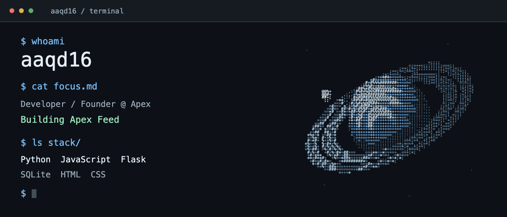

<picture>
  <source media="(prefers-reduced-motion: reduce) and (max-width: 600px)" srcset="assets/terminal-mobile-still.png">
  <source media="(prefers-reduced-motion: reduce)" srcset="assets/terminal-still.png">
  <source media="(max-width: 600px)" srcset="assets/terminal-mobile.gif">
  
</picture>

<h1>Егор Колышев</h1>

Разработчик. Founder <a href="https://apex-ai.com.ru/">Apex</a>.

Пишу на Python и JavaScript. Сейчас развиваю <b>Apex Feed</b>: рабочее место сервисной службы с очередями клиентов, планом смены и разбором звонков.

<code>Python</code> <code>Flask</code> <code>SQLite</code> <code>JavaScript</code> <code>HTML</code> <code>CSS</code>

МШП, олимпиадное программирование. Изучал C++, Python и C#.

<a href="https://apex-ai.com.ru/">Apex Feed</a> — текущий продукт; код пока закрыт. <a href="https://github.com/aaqd16/infodigger-bot">infodigger-bot</a> — открытый Python-репозиторий. <a href="art/terminal.mjs">Исходник ASCII-анимации</a> — геометрия, проекция и отрисовка символами.

  

